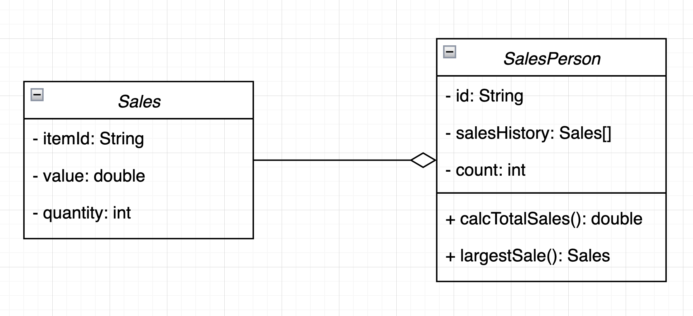
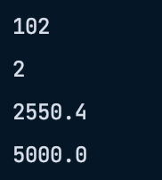

# Forum Activity: Class Design and Implementation Case 

A large company with locations in different cities has taken an OOP approach in creating an administration program that manages all aspects of its business. These aspects include:

- the sale of all the different products that the company manages

- the salaries for managers, office staff and sales personnel.

##### 1. (a) By making use of an example from the above scenario, distinguish between a class and an instantiation of a class. (3 points)

- A class is a template that defines the attributes (properties) and methods (behaviors) that the objects of that class can have. On the other hand, an instantiation of a class refes to creating an object based on that class. 
- A good application of OOP from the above scenario would be: creating a Salary class that has the attributes including `employeeName`, `employeeRole`, `baseSalary`, and `bonus`. Then, we can create a method called `calculateSalary()` which is the sum of the base salary of the employee and the bonus. An instantiation/object of the Salary class can be declared as `employee1Salary`. By creating this instantiation, we can now access and manipulate the attributes and methods of this specific salary object. For instance, the object represents the salary information for an employee with an employee name "Jeff", and employee role as a manager, and furthermore, we can calculate the salary for employee1Salary by calling the `calculateSalary()` method. 

##### The different modules in the program each open a graphical user interface (GUI). Each GUI has a similar design but contains differences specific to each module.

##### (b) By giving two examples, explain how the principles of inheritance can be incorporated into the design of this administration program. (4 points)

- Consider a base GUI class called `BaseGUI` which has standard GUI components such as a menu bar and a header. Each module, such as "Product Management" and "Salary Management" can have its own GUI class `ProductGUI` and `SalaryGUI` that inherits from `BaseGUI`. These module-specific GUI classes can add specific components such as the tables for product data or salary calculation forms. 
- Consider the `Employee` base/super class that describes the common properties and behaviors shared by all workers, such as employee id, employee name, and basic salary. Each subclass (e.g., `Manager`, `OfficeStaff`, `SalesPersonnel`) can inherit from the `Employee` class and add role-specific attributes and methods. 

##### (c) Describe how the use of libraries can facilitate the development of programs like this company’s administration program. (3 points)

- Libraries are incredibly helpful in the development of programs like the company's administration program. They offer reusable code, optimized algorithms, and efficient data structures. They give pre-written and tested code components for developers to use, saving time and effort in development. Moreover, they expand the program's functionality by providing additional features and tools that developers can easily incorporate. 

##### 2. The company employs several sales personnel to sell its products to different retailers. Each branch of the company keeps track of its own sales with a suite of programs that include the two classes SalesPerson and Sales.

```java
public class SalesPerson{
  // each object contains details of one salesperson
  private String id;
  private Sales[] salesHistory; // details of the different sales
  private int count = 0; // number of sales made

	//constructor for a new salesperson
	public SalesPerson(String id){
		// code missing
	}

	// constructor for a salesperson transferred (together with their sales details) from 			another branch
	public SalesPerson(String id, Sales[] s, int c){
		// code missing
	}

  public int getCount(){return count;}

  public String getId() {return id;}

  public void setSalesHistory(Sales s){
    salesHistory[count] = s;
    count = count +1;
  }

	public double calcTotalSales(){
		// calculates total sales for the salesperson
		// code missing
	}

	public Sales largestSale(){
		// calculates the sale with the largest value
		// code missing
	}
}
```

##### Each instance variable is initialized when a SalesPerson object is instantiated.

##### (a) Complete the constructor public SalesPerson(String id), from the SalesPerson class. (2 points)

```java
...
  public SalesPerson(String id) {
      this.id = id;
      this.salesHistory = new Sales[100];
  }
...
```

##### (b) Explain why accessor methods are necessary for the SalesPerson class. (3 points)

- Accessor methods are necessary for the SalesPerson class to promote encapsulation and control access to internal attributes. In the SalesPerson class, it contains private attributes such as the employee id, details of the different sales, and number of sales made. By providing accessor methods, like setSalesHistory(Sales s) or getCount(), it makes sure that the internal properties of a SalesPerson object can be accesssed in a controlled manner. This promotes encapsulation as it prevents direct access to the object's attributes and ensuring that they can only be accessed through the accessor methods. 

```java
public class Sales {
  // each object contains details of one sale
  private String itemId;   // id of the item
  private double value;   // the price of one item
  private int quantity;   // the number of the items sold

  // constructor missing

  public double getValue() {return value;}
  public int getQuantity() {return quantity;}
}
```

##### (c) (i) Construct unified modelling language (UML) diagrams to clearly show the relationship between the SalesPerson and Sales classes.

##### Note: There is no need to include mutator or accessor methods or a constructor. (4 points)



##### (c) (ii) Outline a negative effect that a future change in the design of the Sales object might have on this suite of programs. (2 points)

- Any changes of the `Sales` class will effect on the `SalesPerson` class, due to the fact that some methods and properties on `SalesPerson` class depends on the `Sales` class. For example, the method `calcTotalSales()` in the `SalesPerson` class is fully relied on the accessor methods from the `Sales` class, including `getValue()` and `getQuantity()`. 

##### The company employs several sales personnel. The different salesPerson objects are held in the array salesPeople. The Driver class contains various methods that operate on the SalesPerson and Sales classes. The Driver class contains the following code:

```java
...
  public static void main(String[] args){
    SalesPerson[] salesPeople = new SalesPerson[6];

    salesPeople[0] = new SalesPerson("100");
    salesPeople[1] = new SalesPerson("101");
    salesPeople[2] = new SalesPerson("102");

    salesPeople[0].setSalesHistory(new Sales("A100",300.00,10));
    salesPeople[0].setSalesHistory(new Sales("A200",1000.00,2));
    salesPeople[1].setSalesHistory(new Sales("A300",2550.40,10));

    System.out.println(salesPeople[2].getId());
    System.out.println(salesPeople[0].getCount());
    System.out.println(salesPeople[1].getSalesHistory(0).getValue());
    System.out.println(salesPeople[0].calcTotalSales());
  }
...
```

##### (d) State the output after running this code. (4 points)



##### (e) Construct the method calcTotalSales(), in the SalesPerson class that calculates the total value of the sales for a specific SalesPerson object. (5 points)

```java
...
  public double calcTotalSales() {
    // calculates total sales for the salesperson
    double totalSales = 0;
    for (Sales sales : salesHistory) {
        if (sales == null) {
            break;
        }

        totalSales += sales.getValue() * sales.getQuantity();
    }
    return totalSales;
  }
...
```

##### The salesPeople array contains 100 instantiated objects. The company wishes to reward the salesperson whose sales have the largest total value.

##### (f) By making use of any previously written methods, construct the method highest(), that returns the ID of the salesperson whose sales have the largest total value. (5 points)

```java
... 
	public static String highest(SalesPerson[] salesPeople) {
  	//returns the ID of the salesPerson whose sales have the largest value
    String id = "";
    double highest = salesPeople[0].calcTotalSales();

    for (SalesPerson salesPerson : salesPeople) {
        if (salesPerson == null) {
            break;
        }

        if (salesPerson.calcTotalSales() > highest) {
            highest = salesPerson.calcTotalSales();
            id = salesPerson.getId();
        }
    }

    return id;
  }
...
```

##### (g) Construct the method addSales(Sales s, String id), in the Driver class, that will add a new Sales object s, to the salesperson with a specified ID.

##### Note: You can assume that the ID is a valid one. (4 points)

```java
...
	public static void addSales(Sales s, String id) {
    //add a new Sales object s, to the salesPerson with a specified ID
    for (SalesPerson salesPerson : salesPeople) {
        if (salesPerson != null && salesPerson.getId().equals(id)) {
            salesPerson.setSalesHistory(s);
            return; 
        }
    }
  }
...
```

##### A further class in this suite of programs is the Payroll class. This class is run at the end of each month to calculate each salesperson’s salary, which is based on the sales that have been made during that month.

##### (h) Suggest changes that must be made to the SalesPerson class and/or the Sales class to allow these calculations to be made. (3 points)

In the Sales class, we can include a new attribute called `month` to store the month in which the sale was made. Implement a getter method, `getMonth()`, to retrieve the month in which the sale occurred.

##### (i) Discuss the use of polymorphism that occurs in this suite of programs. (3 points)

We can see the use of polymorphism in the `SalesPerson` class, in which the two constructors `SalesPerson(String id)` and `SalesPerson(String id, Sales[] s, int c)` have the same name but different parameters. 